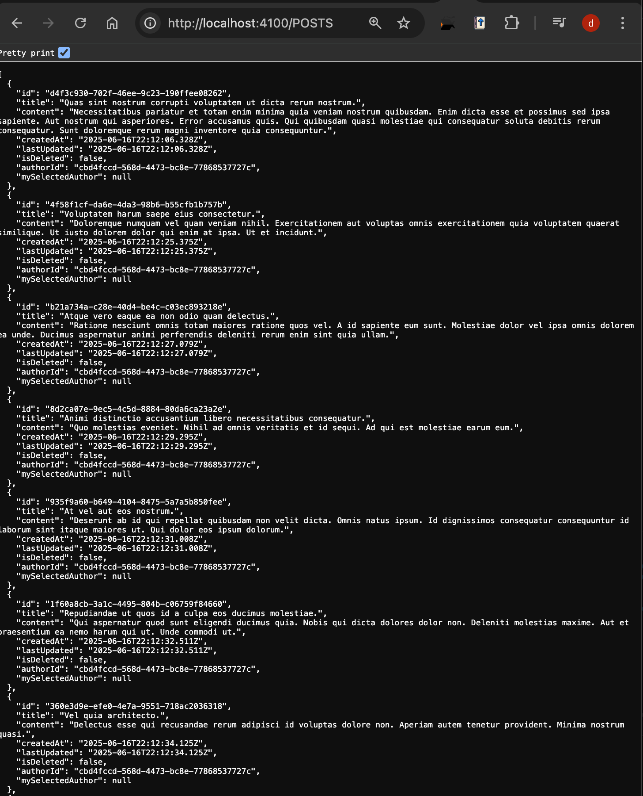

# Blog API

This is a simple blog API built with Express.js, Prisma ORM, and PostgreSQLwhich allows me to manage users and blog posts with full CRUD operations.

you can access it at
```
https://restful-api-on-minimal-blogging-platform-8s72.onrender.com/

```

you can access the `users` at

```
https://restful-api-on-minimal-blogging-platform-8s72.onrender.com/users/

```

you can access the `posts` at

```
https://restful-api-on-minimal-blogging-platform-8s72.onrender.com/posts/

```

## Technologies Used

- **Express.js** for my web framework for Node.js
- **Prisma** as my database ORM
- **PostgreSQL** as my database
- **Node.js** as my runtime environment

## Getting Started

1. Clone the repository
2. Install dependencies using `npm install`
3. Set up your PostgreSQL database
4. Configure your `DATABASE_URL` in `.env` file
5. Run Prisma migrations using`npx prisma migrate dev --name “specify”`
6. Start the server using `node --watch index.js` in development
7. Start the server using `node index.js` in production

The server will run on port 4100 by default.

## Endpoints

### Root Endpoint

#### GET /

- This returns welcome message
- **Response**: HTML welcome page

---

## User Endpoints

### GET /users

- This returns a list of all my users
- **Response**: I used an array of user objects to show all users

e.g

```json
[
  {
    "id": "cbd4fccd-568d-4473-bc8e-77868537727c",
    "firstName": "Marcelle",
    "lastName": "Hermann",
    "username": "Martin2"
  }
]
```

### GET /users/:id

- This returns a single user by ID
- **Parameters**: `id` (string) which is the User ID
- **Response**: User object

### POST /users

- This creates a new user
- **Request Body**:

i used this for users

```json
{
  {
    "firstName": "{{$randomFirstName}}",
    "lastName": "{{$randomLastName}}",
    "emailAddress": "{{$randomEmail}}",
    "username": "{{$randomUserName}}"
}
}
```


i used this for posts

```json
{
  {

    "title": "{{$randomLoremSentence}}",
    "content": "{{$randomLoremParagraph}}",
    "authorId": "cbd4fccd-568d-4473-bc8e-77868537727c"
  }
}

```

- **Response**: Created user object



---

## Post Endpoints

### GET /posts

- Returns a list of all non-deleted posts with author information
- **Response**: Array of post objects with embedded author data

```json
[
  {
    "id": "05038951-5492-4d19-b669-9a3a559805ba",
    "title": "Quia qui magni excepturi rerum aut consectetur natus ullam rerum.",
    "content": "Debitis repellendus minima cumque exercitationem iste non quia laudantium. Dolorum quo eligendi est praesentium omnis dicta odit omnis deserunt. Quia laudantium qui et. Et a omnis eius saepe laudantium neque consequatur nemo. Necessitatibus autem delectus reprehenderit.",
    "createdAt": "2025-06-16T19:32:59.113Z",
    "lastUpdated": "2025-06-16T19:32:59.113Z",
    "author": {
      "id": "cbd4fccd-568d-4473-bc8e-77868537727c",
      "firstName": "Marcelle",
      "lastName": "Hermann",
      "username": "Martin2"
    }
  }
]
```

### GET /posts/:id

- Returns a single post by ID with author information
- **Parameters**: `id` (string) - Post ID
- **Response**: Post object with author data

### POST /posts

- Creates a new blog post
- **Request Body**:

```json
{
   "title": "{{$randomLoremSentence}}",
    "content": "{{$randomLoremParagraph}}",
    "authorId": "cbd4fccd-568d-4473-bc8e-77868537727c"
}
```

- **Response**: Created post object with author information

### PUT /posts/:id

- Updates an existing post
- **Parameters**: `id` (string) - Post ID
- **Request Body**:

```json
{
  "title": "Updated Title",
  "content": "Updated content"
}
```

- **Response**: Updated post object with author information

### DELETE /posts/:id

- Soft deletes a post (marks as deleted, doesn't remove from database)
- **Parameters**: `id` (string) - Post ID
- **Response**: Success message

```json
{
  "message": "HOUSTON! the post has been deleted successfully..! YIKES.."
}
```

---

## Data Models

### User

- `id` (String, UUID, Primary Key)
- `firstName` (String, Required)
- `lastName` (String, Required)
- `emailAddress` (String, Required, Unique)
- `username` (String, Required, Unique)

### Post

- `id` (String, UUID, Primary Key)
- `title` (String, Required)
- `content` (String, Required)
- `createdAt` (DateTime, Auto-generated)
- `lastUpdated` (DateTime, Auto-updated)
- `isDeleted` (Boolean, Default: false)
- `authorId` (String, Foreign Key to User)

---

## Error Handling

All endpoints include error handling with appropriate HTTP status codes:

- `200` - Success
- `201` - Created
- `400` - Bad Request (validation errors)
- `404` - Not Found
- `500` - Internal Server Error

---

## Validation

- User creation requires: `firstName`, `lastName`, `emailAddress`, `username`
- Post creation/update requires: `title`, `content`, `authorId` (for creation only)

---

<br></br>

--------------------_HOUSTON, we have a blog API! _-------------------
